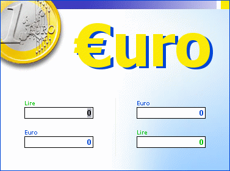

## Euro Converter

### Description

Simple and easy euro converter with a good looking interface. Try it or see its preview before testing!

Thanks if you decide to vote for it.
 
### More Info
 

             |
---                |---
**Submitted On**   |2002-01-11 00:48:30
**By**             |[Philip Morocutti](https://github.com/Planet-Source-Code/PSCIndex/blob/master/ByAuthor/philip-morocutti.md)
**Level**          |Beginner
**User Rating**    |5.0 (10 globes from 2 users)
**Compatibility**  |VB 6\.0
**Category**       |[Complete Applications](https://github.com/Planet-Source-Code/PSCIndex/blob/master/ByCategory/complete-applications__1-27.md)
**World**          |[Visual Basic](https://github.com/Planet-Source-Code/PSCIndex/blob/master/ByWorld/visual-basic.md)
**Archive File**   |[Euro\_Conve477581102002\.zip](https://github.com/Planet-Source-Code/philip-morocutti-euro-converter__1-30661/archive/master.zip)

